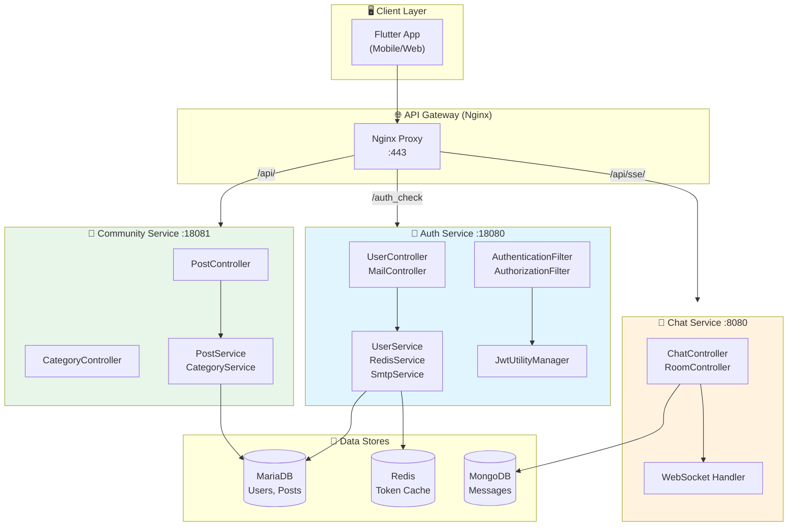
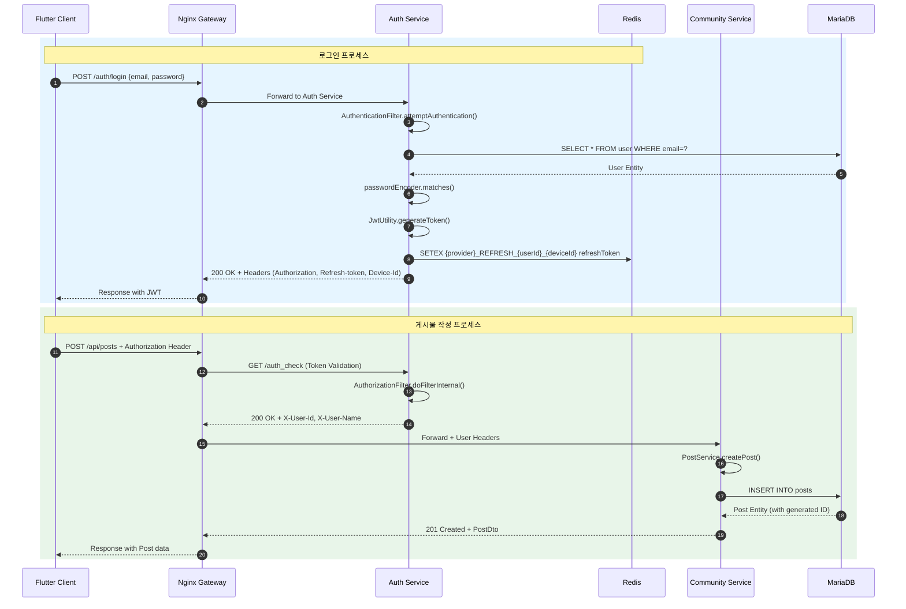
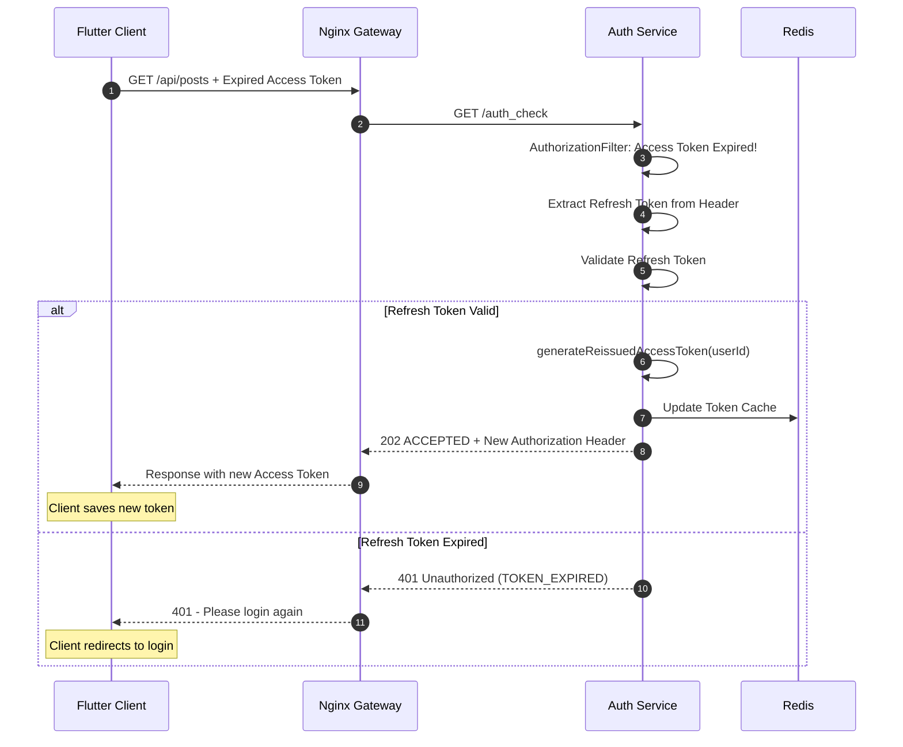
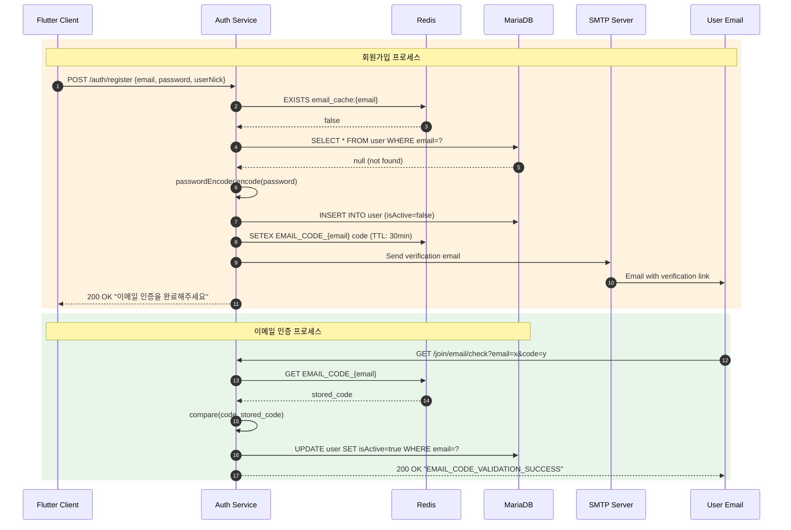

# 서비스 해부학 지도 (Service Anatomy Map)

> **community.nodove.com** 플랫폼의 전체 아키텍처 및 데이터 흐름 분석

---

## 1. 🗺️ 거시적 지형도 (Macro View)

### 서비스 정의

| 서비스 | 포트 | 역할 |
|--------|------|------|
| **Auth Service** | 18080 | JWT 기반 인증/인가, 회원관리, 토큰 발급/갱신 |
| **Community Service** | 18081 | 게시물 CRUD, 카테고리 관리, 검색 기능 |
| **Chat Service** | 8080 | 실시간 WebSocket 채팅, 채팅방 관리 |
| **Flutter App** | - | 크로스플랫폼 모바일/웹 클라이언트 |

### 아키텍처 다이어그램



### 핵심 컴포넌트

#### Auth Service (Java/Spring Boot)
- **`UserController`**: 회원가입, 로그인, 토큰 갱신, 로그아웃 엔드포인트
- **`MailController`**: 이메일 인증 코드 검증, 재발송
- **`AuthenticationFilter`**: `/auth/login` 요청 가로채서 JWT 발급
- **`AuthorizationFilter`**: 모든 요청의 Bearer 토큰 검증
- **`JwtUtilityManager`**: JWT 생성, 파싱, 검증 유틸리티
- **`RedisService`**: Refresh 토큰 저장, 사용자 캐싱, 이메일 코드 저장

#### Community Service (Kotlin/Spring Boot)
- **`PostController`**: 게시물 CRUD, 검색, 좋아요
- **`CategoryController`**: 카테고리 조회
- **`PostService`**: 게시물 비즈니스 로직
- **`CategoryService`**: 카테고리 비즈니스 로직

#### Chat Service (Kotlin/Spring Boot)
- **`ChatController`**: WebSocket 메시지 송수신
- **`RoomController`**: 채팅방 생성
- **`MessageRepository`**: MongoDB 메시지 저장

---

## 2. 📍 엔드포인트 & 진입점 (Entry Points)

### Auth Service (Port: 18080)

| 메서드 | 엔드포인트 | 역할 | 필수 파라미터 | 인증/권한 |
|:------:|:-----------|:-----|:--------------|:----------|
| POST | `/auth/register` | 회원가입 | `email`, `password`, `userNick` | ❌ 불필요 |
| POST | `/auth/login` | 로그인 (Filter 처리) | `email`, `password` | ❌ 불필요 |
| POST | `/auth/refresh` | Access Token 갱신 | Header: `Refresh-token` | ✅ Refresh Token |
| PUT | `/auth/logout` | 로그아웃 | - | ✅ Required |
| GET | `/join/email/check` | 이메일 인증 확인 | `email`, `code` | ❌ 불필요 |
| POST | `/join/email/resend` | 인증 메일 재발송 | `email` | ❌ 불필요 |

### Community Service (Port: 18081)

| 메서드 | 엔드포인트 | 역할 | 필수 파라미터 | 인증/권한 |
|:------:|:-----------|:-----|:--------------|:----------|
| GET | `/api/posts` | 게시물 목록 조회 | `page`, `limit`, `category?`, `sort?` | ❌ Public |
| GET | `/api/posts/{id}` | 게시물 상세 조회 | `id` | ❌ Public |
| POST | `/api/posts` | 게시물 작성 | Body: `title`, `content`, `category`<br/>Header: `X-User-Id`, `X-User-Name` | ✅ Required |
| PUT | `/api/posts/{id}` | 게시물 수정 | `id`, Header: `X-User-Id` | ✅ 본인만 |
| DELETE | `/api/posts/{id}` | 게시물 삭제 | `id`, Header: `X-User-Id` | ✅ 본인만 |
| GET | `/api/posts/recommended` | 추천 게시물 | `limit?` | ❌ Public |
| GET | `/api/posts/latest` | 최신 게시물 | `limit?` | ❌ Public |
| GET | `/api/posts/search` | 게시물 검색 | `keyword`, `page`, `limit` | ❌ Public |
| POST | `/api/posts/{id}/like` | 좋아요 | `id` | ✅ Required |
| DELETE | `/api/posts/{id}/like` | 좋아요 취소 | `id` | ✅ Required |
| GET | `/api/categories` | 전체 카테고리 | - | ❌ Public |
| GET | `/api/categories/popular` | 인기 카테고리 | `limit?` | ❌ Public |
| GET | `/api/categories/{slug}` | 카테고리 상세 | `slug` | ❌ Public |

### Chat Service (Port: 8080)

| 메서드 | 엔드포인트 | 역할 | 필수 파라미터 | 인증/권한 |
|:------:|:-----------|:-----|:--------------|:----------|
| WS | `/chat.sendMessage/{receiver}` | 메시지 전송 | `sender`, `receiver` | ✅ Required |
| WS | `/chat.addUser` | 사용자 입장 | - | ✅ Required |
| GET | `/messages` | 메시지 목록 | - | ✅ Required |
| POST | `/api/room` | 채팅방 생성 | `host`, `guest`, `roomName`, `roomType` | ✅ Required |

---

## 3. 🌊 데이터 흐름 및 변형 추적 (Data Transformation Flow)

### **[시나리오 1: 회원가입 요청]**

```
Client → POST /auth/register → UserController → UserService → DB/Redis/SMTP
```

1. **진입 (UserController.registerUser)**
   - **Input**: `UserRegisterDto { email, password, userNick, username? }`
   - **Validation**: `@Email`, `@NotBlank`, `@Size(min=8)` 어노테이션 검증

2. **중복 검사 (UserService)**
   - **isEmailExist()**: Redis 캐시 → DB 조회 순서로 확인
   - **isUserIdExist()**: `System.currentTimeMillis()` 기반 userId 생성
   - **isUserNickExist()**: 닉네임 중복 확인
   
3. **데이터 변형 (UserService.registerUser)**
   ```java
   // Input → Entity 변환
   User user = User.builder()
       .userId(String.valueOf(System.currentTimeMillis()))  // 자동 생성
       .email(userRegisterDto.getEmail())
       .userNick(userRegisterDto.getUserNick())
       .username(userRegisterDto.getUsername() ?? UUID)     // null이면 UUID
       .password(passwordEncoder.encode(password))          // BCrypt 암호화
       .isActive(false)                                     // 이메일 미인증 상태
       .build();
   ```
   - **@PrePersist**: `createdAt`, `updatedAt` 자동 주입, `userRole = ROLE_USER`

4. **저장 (UserRepository)**
   - **Action**: `INSERT INTO user` 실행
   
5. **후처리 (SmtpService)**
   - **sendJoinMail()**: 이메일 인증 코드 발송
   - **Redis 저장**: `EMAIL_CODE_{email}` → `code` (TTL: 30분)

6. **반환**
   - **Output**: 
   ```json
   {
     "status": "success",
     "code": "CREATED_USER_EMAIL_SEND",
     "message": "이메일 인증을 완료해주세요."
   }
   ```

---

### **[시나리오 2: 로그인 요청]**

```
Client → POST /auth/login → AuthenticationFilter → JWT 발급 → Redis 저장
```

1. **진입 (AuthenticationFilter.attemptAuthentication)**
   - **Input**: `UserLoginRequest { email, password }`
   - **Action**: Request Body 파싱 → `UsernamePasswordAuthenticationToken` 생성
   
2. **인증 (AuthenticationManager)**
   - **PrincipalDetailsService.loadUserByUsername()**: DB에서 User 조회
   - **passwordEncoder.matches()**: 비밀번호 검증
   - **Output**: `Authentication` 객체 (PrincipalDetails 포함)

3. **검증 (AuthenticationFilter.successfulAuthentication)**
   ```java
   if (!principalDetails.isEnabled()) {
       // 이메일 미인증 → 401 Unauthorized
       return;
   }
   ```

4. **토큰 생성 (JwtUtilityManager.generateToken)**
   - **Access Token**: 유효기간 1시간, Claim: `userId`, `email`, `role`
   - **Refresh Token**: 유효기간 30일, Claim: `userId`, `provider`
   - **Output**: `TokenDto { accessToken, refreshToken }`

5. **Redis 저장 (RedisService.saveRefreshToken)**
   - **Key**: `{provider}_REFRESH_{userId}_{deviceId}`
   - **Value**: `refreshToken`
   - **TTL**: 30일

6. **반환 (JwtUtilityManager.loginResponse)**
   - **Headers**:
     ```
     Authorization: Bearer {accessToken}
     Refresh-token: Refresh {refreshToken}
     Device-Id: {uuid}
     ```

---

### **[시나리오 3: 인증된 API 요청]**

```
Client → Authorization Header → AuthorizationFilter → Controller
```

1. **토큰 추출 (AuthorizationFilter.doFilterInternal)**
   ```java
   String authorizationHeader = request.getHeader("Authorization");
   String token = authorizationHeader.substring(7);  // "Bearer " 제거
   ```

2. **토큰 검증**
   - **Access Token 만료 확인**: `jwtUtility.isTokenExpired(token, 0)`
   - **만료 시**: Refresh Token으로 재발급 시도

3. **토큰 재발급 (선택적)**
   ```java
   if (isAccessTokenExpired) {
       String refreshToken = jwtUtility.getRefreshToken(request);
       if (!isRefreshTokenExpired) {
           String newAccessToken = jwtUtility.generateReissuedAccessToken(userId);
           response.setHeader("Authorization", "Bearer " + newAccessToken);
           response.setStatus(202);  // ACCEPTED
       }
   }
   ```

4. **인증 객체 생성**
   ```java
   Authentication authentication = jwtUtility.getAuthentication(token);
   SecurityContextHolder.getContext().setAuthentication(authentication);
   ```

5. **Controller 전달**
   - `@AuthenticationPrincipal PrincipalDetails` 주입 가능

---

### **[시나리오 4: 게시물 작성]**

```
Client → POST /api/posts → Nginx auth_check → Community Service → DB
```

1. **Nginx 인증 확인**
   - **auth_request**: `/auth_check` → Auth Service로 토큰 검증 위임
   - **헤더 추가**: `X-User-Id`, `X-User-Name`, `X-User-Avatar`

2. **진입 (PostController.createPost)**
   - **Input**:
     ```kotlin
     CreatePostRequest { title, content, category, thumbnailUrl? }
     Headers: X-User-Id, X-User-Name, X-User-Avatar?
     ```

3. **Entity 생성 (PostService.createPost)**
   ```kotlin
   val post = Post(
       title = request.title,
       content = request.content,
       category = request.category,
       authorId = userId,           // Header에서 추출
       authorName = userName,       // Header에서 추출
       authorAvatar = userAvatar,   // Header에서 추출 (nullable)
       thumbnailUrl = request.thumbnailUrl
   )
   // 기본값: viewCount=0, likeCount=0, commentCount=0, isPinned=false
   ```

4. **저장 (PostRepository)**
   - **Action**: `INSERT INTO posts`

5. **반환**
   - **Output**: `PostDto` (Entity → DTO 변환)
   ```kotlin
   PostDto.from(savedPost)  // companion object 메서드
   ```

---

### **[시나리오 5: 게시물 목록 조회]**

```
Client → GET /api/posts?page=1&limit=10&sort=latest → PostService → DB
```

1. **정렬 기준 결정 (PostService.getPosts)**
   ```kotlin
   val sortOrder = when (sort) {
       "latest" → Sort.by(DESC, "createdAt")
       "popular" → Sort.by(DESC, "viewCount", "likeCount")
       "comments" → Sort.by(DESC, "commentCount")
       else → Sort.by(DESC, "createdAt")
   }
   ```

2. **페이징 쿼리 실행**
   ```kotlin
   val pageable = PageRequest.of(page - 1, limit, sortOrder)
   val postPage = if (category.isNullOrBlank()) {
       postRepository.findAll(pageable)
   } else {
       postRepository.findByCategory(category, pageable)
   }
   ```

3. **응답 생성**
   ```kotlin
   PostListResponse(
       posts = postPage.content.map { PostDto.from(it) },
       page = page,
       limit = limit,
       totalPages = postPage.totalPages,
       totalCount = postPage.totalElements,
       hasNext = postPage.hasNext()
   )
   ```

---

### **[시나리오 6: 실시간 채팅]**

```
Client → WebSocket /chat.sendMessage/{receiver} → ChatController → MongoDB → Broadcast
```

1. **메시지 수신 (ChatController.sendMessage)**
   - **Input**: `Message { sender, receiver, timestamp? }`

2. **브로드캐스트 (SimpMessagingTemplate)**
   ```kotlin
   messageTemplate.convertAndSend("/topic/messages", message)
   ```

3. **영속화 (MessageRepository)**
   - **MongoDB 저장**: `messages` collection에 Document 저장

4. **반환**
   - **Output**: 동일한 `Message` 객체

---

## 4. 🔍 미시적 세부 사항 (Micro Details & Edge Cases)

### 주요 알고리즘/로직

#### 1. 중복 검사 최적화 (Redis Cache-Aside Pattern)
```java
// UserService.isEmailExist()
if (redisService.UserEmailExists(email)) {
    return true;  // 캐시 히트
}
if (userRepository.findByEmail(email).isPresent()) {
    saveUserEmail(email);  // 캐시 미스 → DB 조회 후 캐시 저장
    return true;
}
return false;
```
- **TTL**: 1일
- **목적**: DB 부하 감소

#### 2. 토큰 재발급 로직
```java
// AuthorizationFilter
if (isAccessTokenExpired && !isRefreshTokenExpired) {
    // Access Token만 재발급
    String newAccessToken = generateReissuedAccessToken(userId);
    response.setHeader("Authorization", "Bearer " + newAccessToken);
    response.setStatus(202);  // Client가 새 토큰 인지하도록
}
```
- **202 ACCEPTED**: 재발급 성공 시 클라이언트에게 알림

#### 3. 조회수 증가 (Transactional)
```kotlin
// PostService.getPost()
@Transactional
fun getPost(id: Long): PostDto {
    val post = postRepository.findById(id).orElseThrow()
    postRepository.incrementViewCount(id)  // UPDATE posts SET view_count = view_count + 1
    return PostDto.from(post)
}
```

### 예외 처리 (Error Handling)

| 상황 | 에러 코드 | HTTP Status | 메시지 |
|------|-----------|-------------|--------|
| 이메일 중복 | - | 400 | "이미 존재하는 이메일입니다." |
| 닉네임 중복 | - | 400 | "이미 존재하는 닉네임입니다." |
| 이메일 미인증 | `USER_DISABLED` | 401 | "User is not enabled" |
| Access Token 만료 | `TOKEN_EXPIRED` | 401 | "Refresh Token is expired" |
| Refresh Token 만료 | `TOKEN_EXPIRED` | 401 | "리프레시 토큰이 만료되었습니다." |
| 게시물 미존재 | - | (Exception) | "Post not found with id: {id}" |
| 수정 권한 없음 | - | (Exception) | "You don't have permission" |
| 이메일 코드 불일치 | `EMAIL_CODE_VALIDATION_FAILED` | 400 | "EMAIL_CODE_VALIDATION_FAILED" |

### 숨겨진 의존성 (Hidden Dependencies)

#### 환경 변수
```yaml
# Auth Service
JWT_SECRET_KEY        # JWT 서명 키 (필수)
JWT_REFRESH_SECRET    # Refresh 토큰 서명 키 (필수)
REDIS_HOST            # Redis 호스트 (default: localhost)
REDIS_PORT            # Redis 포트 (default: 6379)
SMTP_HOST             # SMTP 서버
SMTP_USERNAME         # SMTP 사용자
SMTP_PASSWORD         # SMTP 비밀번호

# Community Service
DB_URL                # jdbc:mariadb://localhost:3306/community
DB_USERNAME           # community
DB_PASSWORD           # community
SPRING_PROFILES_ACTIVE # dev | staging | prod
SERVER_PORT           # 8081

# Chat Service
MONGODB_URI           # MongoDB 연결 문자열
```

#### 외부 시스템 의존성
1. **MariaDB**: Users, Posts, Categories 테이블
2. **Redis**: 토큰 캐싱, 사용자 정보 캐싱, 이메일 코드 저장
3. **MongoDB**: 채팅 메시지 저장
4. **SMTP Server**: 이메일 발송

---

## 5. 🧭 네비게이션 요약

### Sequence Diagram: 로그인 → 게시물 작성



### Sequence Diagram: 토큰 만료 시 재발급



### Sequence Diagram: 회원가입 및 이메일 인증



---

## 📎 부록: 데이터 모델

### User Entity (Auth Service)
```java
@Entity
@Table(name = "user")
class User {
    Long id;                    // AUTO_INCREMENT
    String userId;              // System.currentTimeMillis()
    String email;               // UNIQUE
    String password;            // BCrypt encoded
    String username;            // nullable
    String userNick;            // UNIQUE
    UserRole userRole;          // ROLE_USER | ROLE_ADMIN
    Boolean isActive;           // 이메일 인증 여부
    LocalDateTime createdAt;    // @PrePersist
    LocalDateTime updatedAt;    // @PreUpdate
    LocalDateTime deletedAt;    // Soft delete
}
```

### Post Entity (Community Service)
```kotlin
@Entity
@Table(name = "posts")
data class Post(
    val id: Long,               // AUTO_INCREMENT
    var title: String,          // VARCHAR(200)
    var content: String,        // TEXT
    var category: String,       // VARCHAR(50)
    val authorId: Long,         // FK to user.id
    val authorName: String,     // Denormalized
    val authorAvatar: String?,  // Denormalized
    var viewCount: Int = 0,
    var likeCount: Int = 0,
    var commentCount: Int = 0,
    var thumbnailUrl: String?,
    var isPinned: Boolean = false,
    val createdAt: LocalDateTime,
    var updatedAt: LocalDateTime
)
```

### Message Document (Chat Service)
```kotlin
@Document(collection = "messages")
data class Message(
    val id: String?,            // MongoDB ObjectId
    val sender: String,
    val receiver: String,
    val timestamp: LocalDateTime
)
```

---

## 📊 토큰 유효기간 및 캐시 TTL

| 항목 | 유효기간 | 저장 위치 |
|------|----------|-----------|
| Access Token | 1시간 | Client Header |
| Refresh Token | 30일 | Redis + Client Header |
| Email Code | 30분 | Redis |
| User Email Cache | 1일 | Redis |
| User ID Cache | 1일 | Redis |
| User Nick Cache | 1일 | Redis |
| Block Cache | 가변 (minutes) | Redis |

---

*Last Updated: 2026-01-11*
*Generated by Service Anatomy Analysis*
